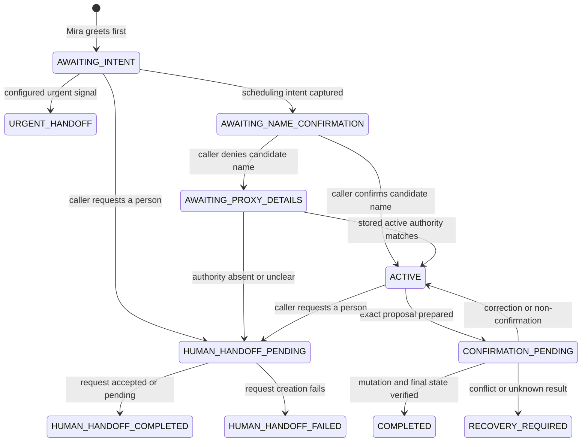
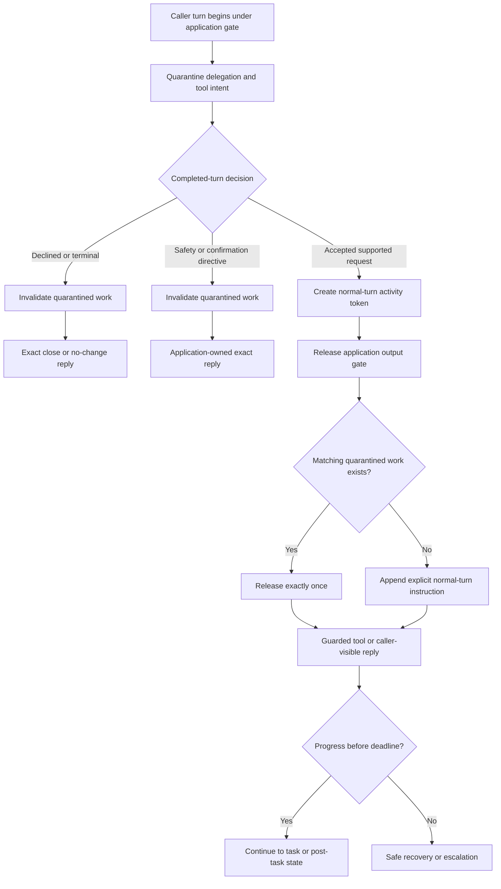

# Agent Runtime Design

Status: Implementation-ready design  
Last updated: 2026-10-05

## Governing idea

Build one event-driven Python agent with three logical planes, not three services:

```text
Conversation plane        Reasoning plane          Transaction plane
------------------        ---------------          -----------------
Twilio                    GPT-6 Sol (low)          Python state reducer
GPT-Live                  semantic decisions       policy guards
audio and turn-taking     tool proposals           confirmation authority
interruptions             response guidance        appointment harness
                                                   verification and recovery
```

GPT-Live may speak. Sol may reason and propose. Only the Python transaction plane may authorize state transitions or protected tools. Keeping the planes in one process makes the ownership boundary explicit without adding network failure modes.

## End-to-end system view

```text
Twilio audio
    |
    v
VoiceEngine: GPT-Live adapter
    |  normalized transcript, turn, interruption, delegation events
    v
CallSessionActor: one serialized mailbox per call
    |
    +--> preemption checks: urgency / human request / correction
    |
    +--> GPT-Live delegates bounded task to Sol-low
    |         |
    |         +--> semantic patient act
    |         +--> proposed workflow action
    |         +--> model-facing tool request
    |
    v
AgentRuntime / StateReducer
    |
    +--> clinic policy and transition guards
    +--> proposal and confirmation authority
    +--> attach server-owned versions, tokens, and idempotency
    |
    v
Appointment Harness / scheduling gateway
    |
    +--> authoritative result
    +--> read-after-write verification
    +--> cancellation follow-up handoff
    |
    v
ResponseDirective -> GPT-Live -> caller
```

Twilio is the preferred telephony adapter, not a prerequisite for exercising the agent. Current trial restrictions may block the `<Stream>` verb required for the bridge. The same runtime therefore accepts browser or synthetic audio during development and evaluation. Transport fallback does not change model selection, workflow state, tools, or safety claims.

## Runtime ownership

| Component | Owns | Must not own |
|---|---|---|
| Twilio adapter | Media frames, call lifecycle, playback marks | Scheduling state or permissions |
| GPT-Live | Spoken dialogue, turn-taking, barge-in, concise delivery | Appointment truth, authorization, final success claims |
| Sol-low | Semantic interpretation, ambiguity detection, bounded planning, typed tool proposals | Mutable session state or direct scheduler access |
| Call actor | Event ordering, lifecycle, delegation correlation, worker coordination | Clinic policy decisions |
| State reducer | Workflow state, invalidation, legal next actions | Network/provider mechanics |
| Guarded tool executor | Permission checks, server-owned command construction, idempotency | Conversational wording |
| Appointment harness | Patients, slots, appointments, versions, fault behavior, audit history | Agent prompt or dialogue policy |
| Event recorder | Redacted trace and timing | Runtime authority |

## OpenAI SDK and tool registration decision

The first implementation uses the direct OpenAI Python Live API client, not the OpenAI Agents SDK. GPT-Live already provides Responses delegation, while this project intentionally owns the event loop, state reducer, confirmation authority, and tool dispatch. Adding an Agents SDK runner would introduce a second orchestration loop without replacing those responsibilities.

The tool schemas are registered under `session.delegation.responses.tools`, so they are visible to the delegated Sol backend and not directly to GPT-Live:

```python
{
    "model": "gpt-live-1",
    "instructions": live_prompt,
    "delegation": {
        "type": "responses",
        "responses": {
            "model": "gpt-6-sol",
            "reasoning": {"effort": "low"},
            "instructions": backend_prompt,
            "tools": currently_allowed_tool_schemas,
            "tool_choice": "auto",
            "parallel_tool_calls": False,
        },
    },
}
```

The model sees only each tool's name, description, and JSON Schema. It never sees the Python implementation or server-owned authorization data. The application may update the visible subset as workflow state changes; an in-flight call from an older tool set is still rejected if its state revision or correction epoch is stale.

Tool-call lifecycle:

1. Sol emits a function call inside a delegated Responses event.
2. The adapter preserves the outer delegation ID and nested response/call IDs.
3. The call actor converts it to a typed `ToolIntent`.
4. The control plane checks state, authority, proposal, confirmation, freshness, and idempotency.
5. The executor enriches the request with server-owned fields and calls the appointment harness.
6. The typed result returns to Sol through the function-result flow.
7. Only a verified, current application directive may be spoken by GPT-Live.

The Agents SDK remains a reversible later option if the project moves to client delegation or needs SDK-managed multi-agent handoffs. It is not used merely to wrap functions that the existing control plane must guard anyway.

## One turn through the system

1. GPT-Live receives audio and handles voice activity and interruption.
2. The adapter emits a normalized patient turn and transcript evidence to the call actor.
3. The actor first checks preemptive conditions: urgent signal, human request, correction, or disconnect.
4. If reasoning is needed, GPT-Live creates a bounded delegation to Sol-low with a state summary and allowed capabilities—not the unrestricted transcript or credentials.
5. Sol returns a semantic patient act and may propose a model-facing tool request.
6. The actor rejects the result if its delegation ID, correction epoch, proposal version, or session state is stale.
7. The state reducer determines the legal next transition.
8. For a tool request, the executor validates policy and attaches server-owned patient authority, versions, proposal ID, confirmation token, and idempotency key.
9. The appointment harness executes the operation and returns a typed result.
10. A write is read back from authoritative state before the reducer marks it verified.
11. The reducer emits a `ResponseDirective` containing permitted facts, required wording constraints, and the next expected patient act.
12. GPT-Live speaks the directive naturally. It cannot turn a proposed or unknown result into success.

## Normalized patient acts

Sol should convert free speech into one of a small number of semantic acts:

```text
state_goal              book | reschedule | cancel
provide_identity        structured identity factors
provide_preference      date/time/location/provider constraints
select_option           proposed slot or existing appointment
confirm_proposal        explicit assent to the immediately active proposal
reject_proposal         explicit rejection
correct_detail          correction with affected field
request_human           caller wants a person
urgent_signal           possible configured urgent condition
ask_clinical_question   unsupported diagnosis/treatment request
ask_administrative      clinic or appointment policy question
unclear                 insufficiently reliable interpretation
```

The semantic act is evidence, not authority. For example, `confirm_proposal` causes the application to check adjacency and proposal identity before minting a confirmation token.

## Unified workflow state

Use one state object with an `operation` discriminator rather than three independent agents:

```text
operation: none | create | edit | delete
phase:
  context_ready
  identity_pending
  identity_verified
  intent_known
  target_appointment_verified
  eligibility_known
  preferences_known
  availability_fresh
  proposal_ready
  confirmation_pending
  action_authorized
  mutation_in_flight
  mutation_unknown
  final_state_verified
  follow_up_in_flight
  completed
  escalated
  urgent_handoff
  no_change
```

Operation-specific requirements are guards on this common spine:

| Phase/requirement | Create | Edit/reschedule | Delete/cancel |
|---|---:|---:|---:|
| Existing appointment verified | No | Yes | Yes |
| Eligibility/prerequisites checked | Yes | As policy requires | No |
| Fresh replacement slot | Yes | Yes | No |
| Exact proposal | New appointment | Current appointment + replacement | Current appointment + cancellation consequence |
| Confirmed mutation | `create_appointment` | `edit_appointment` | `delete_appointment` |
| Read-after-write | Created state | Updated slot/version | Cancelled status/version |
| Follow-up handoff | Optional confirmation delivery | Optional confirmation delivery | Required front-desk follow-up |

### Executable prototype graph

The Python prototype now embeds and updates this graph on every patient turn. Its current snapshot is appended to every Responses request, but only Python may advance it.



The demo identity policy asks whether the caller is the preloaded candidate patient by name. It intentionally does not collect date of birth or postal code. A non-patient caller must match an active synthetic authority record by name and relationship; otherwise the scheduling tools remain locked and the agent requests a human handoff. This is a low-assurance synthetic policy for evaluating orchestration, not a production authentication claim. During `CONFIRMATION_PENDING`, the proposal-bound write is available only on an explicitly confirmed patient turn. Tools are locked in terminal completion, failed-handoff, and urgent-handoff states.

`CONFIRMATION_PENDING` contains an explicit delivery latch in the voice path.
Proposal preparation records the caller `turn_epoch` and leaves confirmation
unarmed. The actor suppresses autonomous proposal wording, appends the exact
application-rendered proposal, and then arms the latch. Confirmation evidence
must come from a strictly later caller epoch. A same-epoch transcript tail is
rejoined to the originating request and invalidates the premature proposal;
arrival after a state transition never changes the meaning of speech that began
before that transition.

### Gate-to-active liveness graph

A caller may state the next request while the application still owns the
post-task follow-up gate. Model work produced during that classifier window is
not executed and is not abandoned: it is quarantined under the current turn
epoch until the deterministic decision arrives.



Every branch is total: it ends in a caller-visible reply, guarded execution,
explicit recovery, escalation, or clean close. Instruction acceptance,
delegation creation, and a first audio frame are telemetry, not terminal proof
that the request was handled.

## Decision graph

Evaluate this graph for every normalized patient act and significant tool event:

```text
potential urgency?
  yes -> invalidate proposal/delegation -> URGENT_HANDOFF
  no
human requested?
  yes -> invalidate proposal/delegation -> ESCALATED
  no
clinical judgment requested?
  yes -> state boundary -> offer approved handoff
  no
identity/authority sufficient for next disclosure or action?
  no -> verify; attempts exhausted -> NO_CHANGE or ESCALATED
  yes
intent known?
  no -> ask one bounded goal question
  yes
edit/delete target appointment verified and versioned?
  no -> retrieve/select exact appointment
  yes or create
eligibility/prerequisites resolved?
  no -> check; policy judgment needed -> ESCALATED
  yes
create/edit search sufficiently constrained?
  no -> ask highest-information preference question
  yes
create/edit availability fresh?
  no -> search authoritative slots
  yes or delete
active proposal exact and current?
  no -> create proposal and read back material details
  yes
explicit adjacent confirmation matches proposal?
  no -> remain CONFIRMATION_PENDING
  yes -> mint one-time token -> ACTION_AUTHORIZED
write outcome?
  rejected/conflict -> invalidate token; refresh or explain no change
  unknown -> reconcile by idempotency key; do not retry blindly
  provisional success -> authoritative read
final state matches confirmed proposal?
  no -> reconcile or escalate
  yes
operation is delete?
  yes -> request front-desk follow-up -> accepted or pending terminal state
  no -> COMPLETED
```

## Confirmation as application authority

The model must not pass a boolean such as `confirmed=true`. The application creates a one-time token only when all of these are true:

1. The session is in `confirmation_pending`.
2. The immediately preceding assistant action presented the active proposal.
3. The patient act is explicit assent, not a vague acknowledgement.
4. No correction, interruption containing new information, or proposal change occurred between presentation and assent.
5. The proposal ID, proposal version, correction epoch, patient authority, and relevant backend versions still match.

The token contains or signs:

```text
session_id
patient_id
operation
proposal_digest
proposal_version
correction_epoch
issued_at
single_use_nonce
```

Any material change invalidates the token. The write executor consumes it once.

## Model-facing versus internal tool arguments

Model-facing schemas should remain narrow:

```text
create_appointment(slot_id)
edit_appointment(appointment_id, replacement_slot_id)
delete_appointment(appointment_id)
```

The Python executor adds the sensitive and authoritative command context:

```text
verified_patient_id
caller_authority
expected_appointment_version
availability_snapshot/version
proposal_id
confirmation_token
idempotency_key
correction_epoch
```

This prevents either model from fabricating authorization evidence. Reads follow the same minimum-necessary rule, but do not require confirmation.

## Prompt responsibilities

### GPT-Live instruction contract

- Be concise and natural for voice; ask one question at a time.
- Delegate backend-dependent facts and scheduling decisions before answering.
- Do not infer identity from the phone number.
- Never say a slot is current, a mutation succeeded, or a handoff was accepted until the application supplies that verified fact.
- Stop immediately for a human request or configured urgent signal.
- Treat an interruption as audio control first; treat it as a correction only after semantic evidence.
- Speak only facts contained in the latest non-stale `ResponseDirective`.

### Sol-low instruction contract

- Interpret the latest patient act using the supplied structured state summary.
- Return typed semantic acts and bounded tool proposals.
- Identify ambiguity rather than guessing dates, appointments, or authority.
- Never invent guard fields, confirmation, tool results, or final state.
- Prefer one highest-information next question.
- Do not produce a final patient-facing success claim.

## Response directive

The control plane returns a typed instruction to the conversation frontend:

```text
directive_id
workflow_epoch
speech_intent
verified_facts
required_disclosures
forbidden_claims
question_to_ask
expected_patient_acts
terminal_outcome (optional)
```

Examples of `speech_intent` include `ask_identity_factor`, `offer_slots`, `present_confirmation`, `report_verified_success`, `report_no_change`, `explain_unknown_result`, and `handoff`.

## Preemption and asynchronous work

- Barge-in stops current playback but does not automatically invalidate valid backend work.
- A semantic correction increments `correction_epoch`, invalidates proposal/confirmation, and suppresses dependent delegated work.
- A human request or urgent signal invalidates all scheduling work and moves to a terminal handoff path.
- A newer delegation supersedes the old one when both address the same decision.
- A late read may be recorded but not spoken if stale.
- A late write result must be reconciled even when stale or disconnected, but it cannot resume automation or be announced without current-session verification.

## Operation flows

### Create

Verify identity → capture appointment type → check eligibility → collect preferences → search fresh slots → propose → confirm → create once → read back → report success.

### Edit/reschedule

Verify identity → retrieve and select exact appointment → capture new preferences → search fresh replacement slots → propose old-to-new change → confirm → edit atomically → read back → report success. A slot race leaves the original appointment unchanged.

### Delete/cancel

Verify identity → retrieve and select exact appointment → present appointment and material cancellation consequence → confirm → soft-cancel once → read back cancelled state → request front-desk follow-up → report `cancelled_with_follow_up` or `cancelled_follow_up_pending` truthfully.

## Python component plan

```text
clinic_agent/
  agent/
    runtime.py            # orchestration facade used by CallSessionActor
    state.py              # immutable state and enums
    events.py             # normalized patient, model, and tool events
    reducer.py            # pure transition function
    decisions.py          # preemption and next-action graph
    confirmation.py       # proposal digest and one-time token authority
    directives.py         # safe response directives
    prompts.py            # GPT-Live and Sol instruction builders
  control_plane/
    tool_contracts.py     # model schemas and server-owned commands
    executor.py           # guard, enrich, dispatch, reconcile, verify
    policy.py             # versioned synthetic clinic policy
  call_mechanics/         # existing actor, voice, and transport boundaries
appointment_harness/      # separate authoritative synthetic backend artifact
```

The reducer should be a pure function of `(state, event) -> (new_state, effects)`. Effects are typed requests such as `Delegate`, `CallTool`, `VerifyState`, `RequestFollowUp`, `Speak`, or `Escalate`. The actor executes effects and returns results as new events. This keeps state tests deterministic and prevents network calls from hiding inside transition logic.

## Vertical implementation slices

### Slice 1 — Deterministic create path

Implement state, reducer, confirmation authority, fake appointment-harness calls, and response directives without models or voice. Prove identity → proposal → exact confirmation → create → verify.

### Slice 2 — Edit and delete branches

Add target appointment/version selection, atomic reschedule, soft cancellation, and required follow-up. Reuse the same authorization pipeline.

### Slice 3 — Text Sol adapter

Map scripted or model-produced utterances to semantic acts. Keep the deterministic patient simulator as the default test path.

### Slice 4 — GPT-Live delegation

Connect normalized delegation events and response directives to the existing call actor. Run correction, barge-in, stale result, early-success, and disconnect cases.

### Slice 5 — Twilio and evaluation loop

Attach the transport adapter, run one inbound conversation, then demonstrate baseline failure → structured reinforcement → full regression rerun.

## Acceptance criteria

- The state machine runs completely without voice or a model.
- GPT-Live and Sol can be replaced without changing tool authority or appointment state.
- Every write is tied to verified identity, current backend versions, exact proposal confirmation, and one idempotency key.
- No stale result is spoken or applied to a newer workflow epoch.
- Unknown write results enter reconciliation rather than retry.
- Cancellation always yields a verified cancelled appointment plus accepted or pending follow-up state.
- Transcript, event trace, and backend state agree on the terminal outcome.
